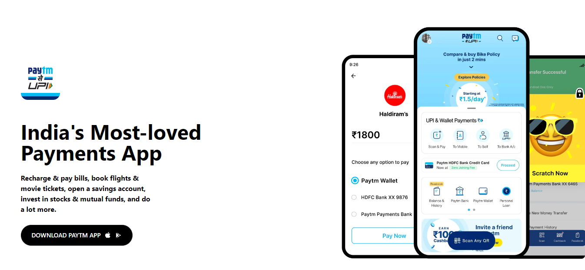

# Paytm Clone 

Hi, My Name is **Jignesh Trivedi** 

- I made this paytm website mobile responsive and got familiar with Tailwind Css

- The most challenging things where:-

    1. Making Paytm Navbar
    
    2. Making The Cards Section and making it responsive

    3. Making Challenging thing was to make it moble responsive

    